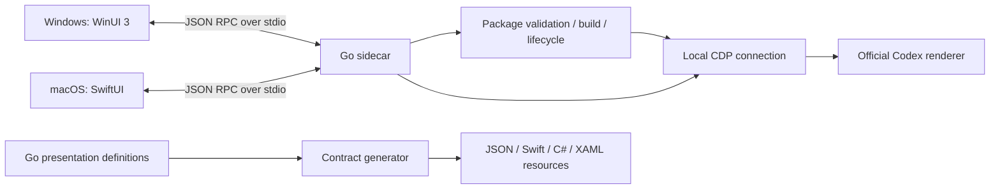

# Architecture

This fork is a companion to the official Codex desktop app. The official window remains the place to chat, edit, approve and run work. Our native control panel, optional floating capsule and selected renderer enhancements surround that workflow. We do not patch, repack or replace the official executable or application bundle.

The shared runtime foundation and isolated companion identity are implemented. The native control panel now includes an appearance page backed by Go settings and a narrow renderer adapter; task metrics and the capsule remain planned. Requirements and acceptance criteria live in the [PRD](docs/desktop-enhancement/PRD.zh-CN.md); this document owns component boundaries, directory placement and naming.

## Existing system

Go owns business state, package trust, process discovery/control, adapters, persistence, updates and logging. Native frontends own their windows, layout, accessibility, input and operating-system presentation. Platform window-following operations may live in C# or Swift; selection of the target, data interpretation and business decisions belong in Go. A capsule is another native view of the same sidecar, not a second monitor service or a new chat client.

The existing package API v3 supplies activation, cleanup, optional Node execution and capability negotiation. `ui.settingsSections` v1 can mount a package section in a supported official settings surface. It does not provide a stable general API for navigation, current thread, quota, composer state or generation speed. Refer to the [package contract](Skills/develop-codex-tweaks-package/SKILL.md) before implementing a package.

## Directory map

| Path | Responsibility and change rule |
| --- | --- |
| `backend/cmd/` | Go entry points, including `contractgen`; keep application wiring here |
| `backend/internal/core/` | Shared business logic and platform-specific Go adapters; existing coherent core stays intact until a demonstrated boundary warrants extraction |
| `backend/internal/rpc/` | Stdio request/response boundary; native clients use the shared business contract |
| `backend/internal/core/presentation*.go` | Authoritative presentation definitions, strings and design tokens |
| `contract/` | Generated protocol snapshot; change the Go source and regenerate |
| `windows/CodexTweaks.Windows/` | WinUI shell, `Pages/`, `Services/`, `Styles/`, and generated resources |
| `app/Sources/` | SwiftUI client and generated presentation types |
| `app/Resources/Tweaks/packages/` | Shipped sample packages; do not assume arbitrary subdirectories can be installed from Git |
| `scripts/` | Build, package, verify and developer bootstrap commands |
| `.github/workflows/` | Pull-request verification and separately controlled release automation |
| `docs/desktop-enhancement/` | Fork PRD, delivery gates, upstream boundary record and dated research |
| `docs/resources/` | Curated source/provenance catalog; no downloaded source or runtime plugin registry |
| `docs/development/` | Developer infrastructure reference |
| `Skills/` | Existing package-authoring instructions; keep the case for compatibility |

`GeneratedPresentationContract.swift`, `Generated/PresentationContract.g.cs`, `Generated/PresentationResources.xaml`, `contract/presentation-contract.json` and `contract/application-identity.json` are generated outputs. Go also supplies the native application identity, protocol version and shutdown grace constants through these generated sources. Windows can regenerate the shared contract with `go run ./cmd/contractgen -root ..` from `backend/`; the macOS `mise run generate` also generates the Xcode project.

Runtime collaborators are narrow interfaces: `Platform` observes or explicitly opens the official app, and `CDPRuntime` binds a verified process identity before renderer effects. Ordinary Controller/RPC tests inject synthetic implementations. Cancellation, page cleanup and listener ownership are separate facts; [runtime foundation](docs/development/runtime-foundation.md) defines their diagnostics and lifecycle contract.

`AppearanceRuntime` is an optional narrow collaborator beside `CDPRuntime`. Its fixed target, revision and owned lease confirm appearance changes without restarting other packages. Go owns saved settings, transient previews and image validation/storage; native pages keep only an editable draft and explicit file selection. The renderer receives bounded values and an owned image data URL, never a user file path. Reading layouts remain unavailable until their ordinary-prose scope is verified; no shared transcript width override is assumed safe.

## Placement of new work

Use existing seams first. Add files only when their feature is implemented; the preparation phase does not create empty module trees.

| Planned concern | First implementation location |
| --- | --- |
| Safe connection, normal/enhanced launch and restoration | Existing `platform*.go`, `cdp.go`, `controller*.go` plus focused tests |
| Account quota and selected-thread observations | Small Go source adapters beside the existing core, with source identity, scope, freshness and unavailable results; private renderer access stays behind its adapter |
| Shared settings, theme selection and metric preferences | Go settings/business state and presentation definitions, then generated DTOs and native binding |
| Companion control panel | Existing native shell and pages; change navigation only when its new destinations exist |
| Capsule and window following | A native window under the respective frontend, sharing its existing backend client and lifecycle |
| Theme/wallpaper renderer behavior | A narrowly scoped package using the current activation/cleanup contract; local directory/ZIP first, separate package repository for Git distribution |
| Pets, advanced notifications, Skills/MCP helpers | Later features after their source/action boundaries are verified; reuse official entry points where possible |

No message bus, microservice, web server, second React shell, generic provider framework or new plugin engine is needed for these initial features. Extract a module when it has its own meaningful contract and tests, or when real duplication requires it.

## Data and compatibility boundaries

Account limits, current-thread token use, generation speed and estimated cost are different measurements. Preserve each source's identity, observation time and scope. Ambiguous selected-thread identity results in unavailable data; the most recently written log is not evidence of the foreground thread. Cost estimates must identify their pricing assumptions and must not be presented as a subscription bill.

Prefer information already available to the official app or verified read-only local sources. Do not read or rewrite credentials, switch accounts, send a model request just to collect statistics, or assume a separately launched `app-server` can observe all official desktop sessions. A missing adapter disables its own dependent feature while the control panel and unrelated capabilities remain usable.

Normal official launch and enhanced launch need separate behavior. At the inherited baseline, renderer injection needs a loopback CDP launch argument, and an already running ordinary instance can require a restart. Automatic startup, hidden startup and the floating capsule are new work. Never promise that merely clicking the original Codex icon already activates every enhancement.

Stopping injection, confirming page cleanup and closing the official process's debug listener are separate internal facts. Show a small set of actionable user states; keep target-level evidence in diagnostics. No automatic force-kill, reload or replacement of an active official session is an acceptable recovery shortcut. Known inherited gaps are recorded in [UPSTREAM.md](docs/desktop-enhancement/UPSTREAM.md).

## Naming and ownership

- Preserve existing `CodexTweaks` internal namespaces and source paths. The installed companion identity and data roots come from Go's `identity.go` and generated application identity; later persisted renames are migrations.
- Use domain names such as `ThemePreset`, `UsageSnapshot`, `ConnectionStatus` and `CapsuleWindow` when the corresponding concept exists. Follow neighboring Go file names, native PascalCase types and lower-kebab-case package/document names.
- Keep branch names, PR numbers, development phases and agent identities out of production symbols and persisted identifiers.
- Keep the PRD authoritative for intended product behavior, this file for structure, [DESIGN.md](DESIGN.md) for visual mapping and [CONTRIBUTING.md](CONTRIBUTING.md) for developer commands. Research documents describe their observed snapshot and do not override newer decisions.

## Delivery boundary

Windows is the first platform for the new companion UX. Shared Go/contract changes still require macOS compatibility and generated-source checks. A Windows-only surface must be represented as an explicit capability, not an unsupported button on macOS.

The application/package identity, data roots and update repository are isolated from upstream. Automatic application updates remain disabled until a companion feed and signing are configured; installation and uninstall acceptance remains a later gate. Current CI builds are verification artifacts. Use the [implementation gates](docs/desktop-enhancement/IMPLEMENTATION.md) for runtime acceptance and [CONTRIBUTING.md](CONTRIBUTING.md) for build checks.
