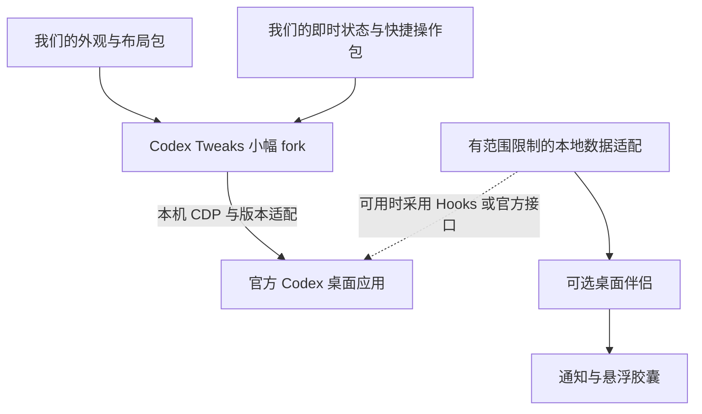

# Codex 桌面增强生态与项目建议

调研日期：2026 年 10 月 2 日，Asia/Singapore。面向 Windows 上的官方 Codex 桌面应用。

> 本文保留早期选型与当时的优先级建议。后续已明确采用“官方 Codex 主窗口 + 独立控制面板 + 可选胶囊”的伴随产品方向；以 [PRD](PRD.zh-CN.md) 为当前需求依据，[资源目录](../resources/README.md) 记录已选参考。文中“先做页面内增强、伴侣后置”等建议不再代表当前交付顺序。

这份分析回答两个问题：社区已经做出了哪些桌面增强；如果由我们主导一个项目，应该 fork 什么、优先增强什么。范围是正在使用 Codex 时的 UI、交互、即时反馈、输入和功能体验。汇思与离线对话分析不纳入选型；`zcode-monitor` 只提供产品体验参考。

**我的建议是做一个可按需开启功能的 Codex 桌面增强工具。优先以 Codex Tweaks 为宿主候选，保持小幅 fork，把主要开发放在自己的功能包；先交付外观与布局、随手可见的状态、顺手的交互，再补桌面提醒和性能诊断。** 这条路线最接近“继续用官方 App，同时把它变得更顺手”的目标。它依赖非官方界面适配，因此推荐进入兼容性验证，尚不能宣称在你当前版本上已经稳定可用。[Codex Tweaks](https://github.com/codex-tweaks/codex-tweaks)

本次做了多方向并行搜索、仓库文档和关键源码检查。没有安装候选、运行其启动器、修改 Codex 配置或创建 fork。文中的“支持”优先说明作者支持范围；“源码确认”表示静态检查；“建议”表示我的产品判断，均不等同于本机实测。

## 最值得先看的项目

| 项目 | 对日常桌面体验的价值 | Windows 与集成方式 | 我的判断 |
| --- | --- | --- | --- |
| [Codex Tweaks](https://github.com/codex-tweaks/codex-tweaks) | 在官方 App 中管理多个 UI 与交互功能包，可开关、更新和恢复 | 有原生 Windows 客户端；通过本机 CDP 注入；MIT | **通用增强主线的首选候选** |
| [Codex Token Overlay](https://github.com/soleillevant0125/codex-token-overlay) | 胶囊跟随 Codex 窗口，显示当前选中会话的 token 与上下文信息，不抢输入焦点 | Windows .NET／WinForms；独立覆盖窗口，读取本地 IPC 与日志；MIT | **轻量外置控件的首选候选** |
| [Codex Dream Skin](https://github.com/Fei-Away/Codex-Dream-Skin) | 背景、磨砂、透明度等视觉定制 | Windows／macOS；CDP；MIT | 适合先做单一换肤实验 |
| [CodeDrobe](https://github.com/CodeDrobe/desktop) | 可视化主题选择、应用与恢复 | Windows／macOS；CDP；桌面壳 MPL-2.0，core Apache-2.0 | 借鉴主题产品体验，复用时核对组件许可 |
| [Token Monitor](https://github.com/Javis603/token-monitor) | 可定制 widget、边缘停靠、气泡、用量与限额 | Electron，包含 Windows；读取多种本地数据及服务端用量 | 控件体验参考价值高，整个项目范围偏大 |
| [Codex Windows Notify](https://github.com/Barbital11111/codex-windows-notify) | 完成、错误、审批及额度提醒卡片 | Windows，WinForms＋WebView2；notify 与日志补偿；MIT | 适合借鉴提醒模块，协议需更新验证 |

这六个项目覆盖“界面内部、窗口旁边、系统桌面”三个使用位置。我的优先级依据是与你目标的贴合度、Windows 可行性和后续改造范围；没有按 Star 数简单排序。

## 官方能力和社区能力的边界

官方已经支持选择基础主题、调整强调色及前景背景色、设置 UI 与代码字体，以及分享主题。因此只调整配色时，应先利用原生能力；社区的价值主要在壁纸、布局、额外状态和更深的交互。[官方 Appearance 文档](https://learn.chatgpt.com/docs/reference/settings#appearance)

官方插件可以组合 Skills、MCP、可选 UI 和生命周期 Hooks。但“插件能返回 UI”不等于它可以任意替换 Codex 的侧栏、输入框或整个窗口。在本次核对的公开文档中，没有找到面向整套桌面界面的稳定通用换肤 API。Codex Tweaks 的功能包协议是它自己的社区协议。[官方插件架构](https://developers.openai.com/plugins/concepts/plugins)

需要把下面几种路线分开看：

| 路线 | 能带来的体验 | 主要边界 |
| --- | --- | --- |
| 原生设置与官方插件 | 配色、字体、工具、工作流、特定可视组件 | 能力由宿主公开接口决定 |
| 官方 Hooks | 完成、工具、审批请求等生命周期事件驱动的辅助能力 | 事件与信任流程要符合实际 runtime，不能直接假定所有客户端完全一致 |
| 独立桌面伴侣 | 托盘、悬浮状态、全局快捷键、系统通知 | 不自动拥有当前选中会话的身份或控制权 |
| CDP 运行时增强 | 壁纸、布局、组件、界面内快捷操作 | 依赖内部页面结构；要开启本地调试连接 |
| 应用包补丁 | 更深的窗口和内部功能修改 | 与具体发行版本耦合，签名、更新与回退成本更高 |
| 自建桌面客户端 | 完全掌控自己的 UI 和会话工作流 | 要重新承担客户端功能，不能自动继承官方 App 的全部体验 |

官方 `app-server` 为自建客户端提供会话、认证、审批和事件接口，且可以按本地版本生成协议类型。这对接入 Codex 引擎很有价值，但启动另一个 app-server **不证明它能直接观察、控制官方 App 当前窗口里的正在运行会话**；连接对象与事件覆盖需要单独验证。官方文档也对实验性 transport 作了明确限制。[App Server](https://learn.chatgpt.com/docs/app-server)、[Hooks](https://developers.openai.com/codex/hooks)

官方开源清单列出了 CLI、SDK、App Server、Skills 和 Plugins 等组件。选型时不能把 `openai/codex` 当成已经提供了完整官方桌面 UI 的 fork 起点。[官方开源组件清单](https://learn.chatgpt.com/docs/open-source)

## 为什么优先考虑 Codex Tweaks

### 它已经具备我们需要的增强宿主

仓库提供原生 Windows 和 macOS 客户端、功能包启停、依赖顺序、编译和更新、失败回退、目录／ZIP／Git 安装，以及关闭全部界面增强的入口。这些能力与“以后持续加自己想要的东西”的目标直接相关。[README](https://github.com/codex-tweaks/codex-tweaks/blob/main/README.md)

源码检查确认其 Windows 端为 WinUI 3／.NET 10，共享后端使用 Go，通过本机 CDP 连接运行中的 Codex；它不采用修改 `app.asar` 的方式。功能包包含生命周期清理和 Renderer 与独立 Node 进程通信能力，API v3 也支持设置页注册。这里的扩展空间比一个固定用途的壁纸脚本大，但仍建立在社区对宿主内部结构的适配上。[源码](https://github.com/codex-tweaks/codex-tweaks)、[功能包开发契约](https://github.com/codex-tweaks/codex-tweaks/blob/main/Skills/develop-codex-tweaks-package/SKILL.md)

读取时观察到 v3.5.9 发布于 2026 年 10 月 2 日 SGT，有 Windows x64／ARM64 发布产物和成功的 CI／Release 工作流。这是近期维护的积极信号，仍不能替代本机兼容性测试。主分支核验 commit 为 `2c768f4`。[Releases](https://github.com/codex-tweaks/codex-tweaks/releases)、[CI 记录](https://github.com/codex-tweaks/codex-tweaks/actions/runs/36901617330)、[Windows 工程](https://github.com/codex-tweaks/codex-tweaks/blob/2c768f42579463254357ff1afaa4c38fc7d40cb1/windows/CodexTweaks.Windows/CodexTweaks.Windows.csproj)

### 已经有一组实际功能包

| 功能包 | 已有功能 | 作者声明的平台验证与限制 |
| --- | --- | --- |
| [custom-background](https://github.com/codex-tweaks/codex-tweaks-custom-background) | 本地或远程背景、遮罩、模糊、设置页、快捷按钮 | 已测 macOS；Windows 需要补测。整包声明 Node 并需授权，远程／随机模式还需要网络 |
| [usage-overview](https://github.com/codex-tweaks/codex-tweaks-usage-overview) | 侧栏常驻额度、悬停详情与重置时间 | README 明确 Windows 已验证额度显示与悬停；读取宿主现有状态，不自行发网络请求，也不使用 Node |
| [unified-chat-sidebar](https://github.com/codex-tweaks/codex-tweaks-unified-chat-sidebar) | 在 Codex 模式显示聊天入口、统一列表、来源标签和手动刷新 | 已测 macOS；包含 Windows 定位逻辑，但这不等于完成 Windows 全体验验证；依赖 React 与侧栏内部结构 |
| [demo-mode](https://github.com/codex-tweaks/codex-tweaks-demo-mode) | 录屏／截图时用合成项目与标题替代真实侧栏内容 | 已测 macOS；Windows 视觉待验。只遮蔽侧栏，正文、搜索和通知仍可能显示真实信息 |

四个包均有 MIT 许可说明。它们证明这个宿主已经能承载不同类型的增强，不过生态仍小，功能包的 Windows 验证程度各不相同。特别值得借鉴的是 `usage-overview`：尽量复用宿主已经获取的状态，减少重复登录、重复请求与额外凭据处理。上游背景包只切换到本地图片模式并不会免除整包 Node 授权，首轮低权限实验需要另行裁剪。[背景包 manifest](https://github.com/codex-tweaks/codex-tweaks-custom-background/blob/main/package.json)

### 我会怎样 fork

**建议保留一个尽量贴近上游的宿主 fork，自己维护功能包。** 宿主只承担确实需要的 Windows 兼容、连接与恢复改进；壁纸、紧凑布局、状态条、提示词片段等放在各自功能包中。这样可以持续跟随上游，也便于单独停用一个失效功能。

源码检查发现两个应在采用前处理的具体问题：Windows 的重启流程按 `ChatGPT.exe` 进程名结束进程，并带有超时后强制结束路径；关闭增强清理的是 UI 注入，本地 CDP 连接能力并不会随之自动消失。前者关系到活动任务和未保存输入，后者关系到用户是否真正退出增强模式。应先验证并改好这些行为，再把“一键重启／恢复”交付为日常功能。[Windows 重启实现](https://github.com/codex-tweaks/codex-tweaks/blob/2c768f42579463254357ff1afaa4c38fc7d40cb1/backend/internal/core/platform_windows.go#L143)、[停用实现](https://github.com/codex-tweaks/codex-tweaks/blob/2c768f42579463254357ff1afaa4c38fc7d40cb1/backend/internal/core/controller_runtime.go#L93)

功能包的 Node 端具备当前用户的执行权限，Renderer 包也可能访问页面内容。已有逐版本授权与依赖变更失效机制是有用基础，但不是操作系统沙箱。授权前的构建跳过 npm 安装脚本，信任 Node 后存在允许这些脚本运行的路径，不能理解为“第三方包永远不会运行安装脚本”。我们的首批包尽量只用 Renderer；需要本地服务的能力再单独声明用途。[授权实现](https://github.com/codex-tweaks/codex-tweaks/blob/2c768f42579463254357ff1afaa4c38fc7d40cb1/backend/internal/core/node_authorization.go#L22)、[Node 运行时](https://github.com/codex-tweaks/codex-tweaks/blob/2c768f42579463254357ff1afaa4c38fc7d40cb1/backend/internal/core/node_runtime.go#L247)

## 我建议增强的具体体验

下面是产品建议，不是声称现成仓库已经全部实现。目标是让日常操作更省心，每项都应能单独关闭。

### 外观和布局

第一版就应有能看见的变化：本地壁纸、可调遮罩、舒服的文本宽度、紧凑侧栏、代码块显示偏好，以及一键进入专注布局。壁纸只负责营造环境，正文与输入框必须保持可读；动态背景与大面积实时模糊默认关闭。

主题预设同时定义颜色、字体、间距与控件密度，避免只换一个背景后其余部分仍各不相同。原生已经能完成的配色继续使用原生入口，社区包补足布局和背景能力。`custom-background`、Dream Skin、CodeDrobe 是这一方向的参考。

### 当前任务的状态条

在侧栏或输入区附近放一个简洁状态条：当前会话身份、实际可得的运行状态、上下文占用、额度及重置时间。默认只显示最常用的两三项，悬停或点击展开更多。

必须区分“当前选中会话”“最近写入日志的会话”和“账户额度”。不能因为某个后台任务刚写了日志，就把它的数字贴到前台对话上。`codex-token-overlay` 已展示了用内部 IPC 跟随当前任务、再读取对应日志的办法；IPC 不可用时要明确显示失联或降级，而不是悄悄冒充精确跟随。[README](https://github.com/soleillevant0125/codex-token-overlay)、[Windows 读取实现](https://github.com/soleillevant0125/codex-token-overlay/blob/main/src/CodexTokenOverlay/Program.cs)

### 顺手的操作

我会先做少量高频能力：常用提示词片段、长对话的段落定位、复制当前可见代码／结果、切换专注布局，以及一键回到需要处理的任务。提示词插入保留为草稿，由用户发送；切换任务不能丢失输入框已有内容。

在具体做某个按钮前先检查当前 App 原有快捷键和菜单。如果原生入口已经足够好，就做更易发现的入口，避免维护第二套相同逻辑。涉及聊天导航、草稿、发送或审批的能力，都要按当前宿主真实接口验证，不能仅凭 DOM 看起来可点击就认为语义安全。

### 低打扰的提醒

完成、失败、需要输入时给出可点击提醒；当前窗口正在使用时减少重复弹窗。支持静音、合并同一任务事件、冷却期、夜间安静模式和通知内容隐藏。首版的提醒动作是定位任务，让用户回到原生上下文处理。

参考 Codex Windows Notify 的卡片，以及 zcode-monitor 的状态与防重发思路。官方 Hooks 已有 `Stop`、`PermissionRequest`、`SubagentStop` 等事件，可优先验证；日志推测只作为缺失事件的降级来源，不把“很久没输出”直接标成“正在等你审批”。[Hooks](https://developers.openai.com/codex/hooks)、[Codex Windows Notify](https://github.com/Barbital11111/codex-windows-notify)

### 性能体验

“速度”应分成界面反应、任务等待和模型生成三件事。我们能控制增强包自身的扫描、渲染与监听成本，也能把卡顿证据整理出来；不能承诺靠一个插件普遍加快模型推理。

建议加入简明健康页：增强包耗时、事件积压、内存趋势、后台扫描负担，以及最近一次失联原因。先提供暂停所有增强和导出脱敏诊断，再考虑针对已确认问题的修复。社区 `codex-perf` 包含会修改持久化会话标题的修复路径，适合作为诊断案例，不能包装成无副作用的通用加速按钮。[codex-perf](https://github.com/clairernovotny/codex-perf)、[标题写入源码](https://github.com/clairernovotny/codex-perf/blob/94ea68005a13da87b44e97500a724cfdcf949c38/renderer/fast-thread-loader.js#L472)

### 个性与辅助输入

桌宠、声音、全局语音输入和外部控制器可以作为第二批功能。桌宠应显示有用状态，支持隐藏和减少动画；语音优先补原生体验的真实缺口，例如跨应用输入，而不是因为社区有项目就重复造一套。

我尤其看好“录屏演示模式”和“可一键关掉的专注布局”：前者方便展示项目，后者几乎每天可用，比不断堆积统计图更符合本项目目标。演示模式需要单独验证其覆盖范围，不能当成完整的隐私屏障。

## 各类社区项目的取舍

### 换肤和直接修改界面的项目

| 项目 | 能借鉴什么 | 采用边界 |
| --- | --- | --- |
| [Codex Dream Skin](https://github.com/Fei-Away/Codex-Dream-Skin) | 单用途换肤、Windows 启动与回滚体验 | 不改安装包，但仍需 CDP 与页面适配 |
| [CodeDrobe Desktop](https://github.com/CodeDrobe/desktop) | 主题预览、应用、恢复 | 比自做一个主题商店更完整；关注不同组件许可 |
| [Codex Dynamic Skin](https://github.com/CCDawn/Codex-Dynamic-Skin) | 动态视觉与背景管理 | 动效会增加渲染负担，作为可选视觉实验 |
| [Codex Theme Engine](https://github.com/than0112/codex-theme-engine) | 数据化主题与运行时应用 | 作者给出的 Windows 验证针对特定旧版本，仍需当前版本复测 |
| [codex-theme-inject](https://github.com/codecnmc/codex-theme-inject/tree/clean-version) | 功能丰富的主题面板与宠物库 | 本次未确认清晰的仓库级许可，不列入可直接复用分发的底座 |
| [Modex](https://github.com/nicosuave/modex) | 多任务分栏／标签页、模型与推理档位控件、主题图标 | macOS；构建修改后的独立签名 App。本次未确认明确许可证，先参考交互 |
| [codex-plusplus](https://github.com/b-nnett/codex-plusplus) | 了解早期增强思路 | 读取时已归档，不能因热度高就作为长期首选 |

我会优先借鉴 Modex 的“多个任务更好地并排工作”这个需求，但暂不承诺在我们的功能包里实现完整分栏。它牵涉任务生命周期、焦点、草稿和宿主状态，难度显著高于布局换肤。[Modex](https://github.com/nicosuave/modex)

其他低侵入参考还有 [Codex Theme Galaxy](https://github.com/CosmicCoderDev/codex-themes) 的原生主题分享。使用代码或主题预设时，也要把背景图片等素材的授权分开判断。CodeDrobe Core 在指定基础主题时会管理部分 Codex 外观配置，因此“不修改 App 安装文件”不代表不改配置。实际试用时只选一个注入与主题控制者，避免多个工具同时覆盖同一套界面状态。[CodeDrobe Core](https://github.com/CodeDrobe/core)

### 即时控件与监控

| 项目 | 对本项目有用的部分 | 为什么不直接全部照搬 |
| --- | --- | --- |
| [Codex Token Overlay](https://github.com/soleillevant0125/codex-token-overlay) | 跟随当前窗口与会话、不抢焦点、可展开胶囊 | 内部 IPC 和日志格式不是公开稳定协议；功能较专一 |
| [Token Monitor](https://github.com/Javis603/token-monitor) | 气泡、停靠、主题和多种密度的控件 | 多工具统计、同步、账户功能远超首版范围；有处理与写入认证文件的路径 |
| [CodexBar](https://github.com/steipete/CodexBar) | 紧凑地表达多个额度窗口 | 桌面 GUI 重点在 macOS，Windows 不宜直接当现成底座 |
| [Win-CodexBar](https://github.com/arcobaleno64/Win-CodexBar) | Windows 常驻额度展示 | 核对独立实现的数据来源，不能沿用原项目的信任判断 |
| [Tooblippe codex-usage](https://github.com/Tooblippe/codex-usage) | 轻量 .NET 托盘，使用 app-server 读取额度的思路 | 源码调用参数与当前文档存在需实测的兼容差异 |
| [upstream-ray codex-usage-monitor](https://github.com/upstream-ray/codex-usage-monitor) | 原生 Rust 任务栏展示 | 认证失效时存在启动最小模型请求的刷新路径，不能按完全被动监控采用 |
| [VictorZakharov codex-usage](https://github.com/VictorZakharov/codex-usage) | 原生 Windows 托盘体验 | 会刷新并写回共享认证文件，属于需要更仔细审查的账号操作 |

额度接口、会话 token 和估算费用应保持不同含义。会话累计 token 不是订阅剩余额度，也不是实际账单；缺数据时应显示未知。我们的核心需求是“现在发生什么、是否要我处理”，历史报表无需成为主要界面。

### 桌宠和通知

| 项目 | 看点 | 判断 |
| --- | --- | --- |
| [codex-windows-status-pet](https://github.com/TomTang701/codex-windows-status-pet) | 用桌宠表达当前活动 | 适合研究轻量反馈，需验证状态来源与新版本兼容 |
| [codex-pet-hud](https://github.com/himomohi/codex-pet-hud) | 贴靠官方桌宠的 Windows WPF 用量 HUD | Windows 处于 preview；有直接读取认证并请求私有用量端点的实现，先借鉴视觉 |
| [Codex Windows Notify](https://github.com/Barbital11111/codex-windows-notify) | 浮动通知、去重和回到任务 | README 的 notify 契约及旧运行时需要当前兼容性核实 |

### 语音与外部控制器

| 项目 | 看点 | 与我们项目的关系 |
| --- | --- | --- |
| [Mello Voice](https://github.com/2ne/mello-voice) | Windows 为主的本地 Whisper 输入、快捷键和浮动条；MIT | 可独立配合 Codex 使用，适合输入体验参考 |
| [SpeakEasy](https://github.com/arach/speakeasy) | macOS 上面向选定 Codex 任务的语音通道和播报 | 借鉴明确绑定任务的交互，不是 Windows 现成方案 |
| [Codex Voice Input](https://github.com/A3Boy/codex-voice-input) | Windows 全局语音输入 | 复用逆向得到的转写端点与登录态，协议稳定性不能按官方 API 看待 |
| [emollick codex-stream-deck](https://github.com/emollick/codex-stream-deck) | 按键显示任务与状态、跳转、健康检查；MIT | 说明增强可以延伸到硬件，但主动状态检查可能启动模型回合 |
| [dazer1234 codex-stream-deck](https://github.com/dazer1234/codex-stream-deck) | Windows／macOS 上复用原生 Micro 交互模型 | 借鉴任务切换、旋钮和快捷动作；依赖未公开内部接口 |

这些项目说明“桌面体验”还可以向输入、声音和硬件控制延伸。不过首版没有必要同时承担语音模型、手机联动和硬件兼容。先把官方 App 内与旁边的体验做好，再选一个实际高频场景扩展。

## 其他桌面 harness 能给我们什么启发

完整客户端值得研究交互设计，但它们是另一条产品路线。用户继续使用官方 App 时，这些项目不会自动给当前窗口增加功能。

| 项目 | 集成与平台 | 借鉴价值及采用判断 |
| --- | --- | --- |
| [CodexMonitor](https://github.com/Dimillian/CodexMonitor) | Tauri＋React＋Rust，Codex app-server；MIT | 项目／会话工作台、运行和未读状态值得参考；部分托盘实现仅 macOS，Windows 构建不代表功能完全一致 |
| [Harnss](https://github.com/OpenSource03/harnss) | Electron＋React；Codex app-server，Claude SDK，其他 agent 使用 ACP；MIT | 后台任务面板、耗时反馈和多引擎交互有价值；README 提示准备大幅重写 |
| [AionUi](https://github.com/iOfficeAI/AionUi) | Electron，多 agent／ACP；Apache-2.0 | 可借鉴桌面工作台与工具入口，整体范围远大于本项目 |
| [CodePilot](https://github.com/op7418/CodePilot) | 多模型桌面工作台 | 当前 BSL-1.1，应按具体条款评估，不能只因代码公开就列为宽松许可底座 |
| [1Code](https://github.com/21st-dev/1code) | 多 agent 客户端 | 读取时仓库已归档，适合作为交互样本 |
| [OpenCode](https://github.com/anomalyco/opencode) | 自有 agent 与桌面客户端；MIT | 借鉴项目导航、状态和多前端设计，不作为官方 Codex 的插件 |
| [Happy](https://github.com/slopus/happy) | 移动／Web 与 CLI 包装器；MIT | 借鉴推送与跨设备接力；不能据此承诺直接接管官方 App 现有会话 |
| [DeepSeek Harness Desktop](https://github.com/web-casa/DeepSeek-Harness-Desktop) | Tauri＋Svelte＋Rust sidecar；Windows；MIT | 借鉴独立数据目录、进程生命周期和连接健康；不是 Codex 客户端 |
| [ZCode Extensions](https://github.com/notmike101/zcode-extensions) | ZCode 的社区扩展宿主；MIT | 借鉴扩展隔离与恢复；其 loader 会改应用包布局，不能直接迁到 Codex |

用户提到的 DSH 无法仅凭缩写唯一识别。调研将 DeepSeek Harness 周边桌面项目作为相邻生态线索，没有把它们认定为你具体指的那个项目。这一不确定性不影响本次围绕 Codex 官方桌面增强的推荐。

维护信号也影响 fork 选择：本次核验的 CodexMonitor HEAD 为 2026 年 3 月 26 日；Harnss 为 6 月 19 日且 README 提示待重写；AionUi 为 9 月 9 日；所列 DeepSeek Harness Desktop 为 8 月 29 日。这些日期只说明本次读取到的仓库快照，不单独证明项目可靠或已经停止维护。[CodexMonitor commit](https://github.com/Dimillian/CodexMonitor/commit/dd61b9abd37de5ded86e82b9fe8a83fd49d46fa5)、[Harnss README](https://github.com/OpenSource03/harnss/blob/dc1dfd8a33caa46a1eefcfe9e14697b27ac4c33d/README.md)、[AionUi commit](https://github.com/iOfficeAI/AionUi/commit/6744099b279b991c17e31c243f0920477bd31cb6)、[DSH Desktop commit](https://github.com/web-casa/DeepSeek-Harness-Desktop/commit/4e9c6113c475cb94ebffd3ba83828875361f3b16)

对 zcode-monitor，我会借用“紧凑状态入口、来源与新鲜度、及时但克制的提醒”的思路。它的数据源围绕 ZCode 运行记录设计；不能通过替换一个目录路径就完整移植到 Codex。其既有大量历史分析页面不应决定新项目的形态。[上游仓库](https://github.com/yiyanwannian/zcode-monitor)

## 项目形态与迭代顺序

### 建议的组成

第一阶段不必把独立桌面伴侣也做完。先让功能包的收益成立，再判断是否确实需要在 Codex 不处于前台时持续显示状态。如果需要，优先评估复用 Token Overlay 的窗口与焦点处理，或写一个范围相当的小模块。

### 第一轮验证

先固定上游 commit，在独立环境验证当前 Windows Codex 版本：连接、启用、停用、窗口切换、缩放、多显示器、输入框焦点、App 更新后的失效表现。优先验证 `usage-overview` 和自行裁剪的 Renderer-only 本地背景包，不加载一整套陌生扩展。后者需要去掉上游背景包的 Node 声明与远程图片流程，不是简单换一个图片来源选项。

采用宿主的判断条件是：退出增强后能够回到正常界面；失败不会丢草稿或结束活动任务；当前会话身份不串线；包不需要的权限不启用。如果 CDP 路线在当前发行版不可靠，先采用 Token Overlay 式外置伴侣，待界面适配成立后再合并体验。

### 第一版功能

建议第一版只包含四项：**外观与阅读布局、侧栏即时状态、一个高频快捷操作面板、完整的启停与恢复入口。** 这已经能每天感受到价值，也能验证功能包架构是否真的适合我们。

成功标准是：切换主题不会让字看不清，长会话滚动没有可察觉的新卡顿，状态不会展示到错误任务上，停用后焦点和界面恢复正常。性能目标应从本机未启用增强时的基线确定，不先宣传一个没有测量依据的加速百分比。

### 第二版功能

补充窗口外提醒、悬浮胶囊、专注模式细节、录屏演示模式和问题诊断。只在真实使用确认需求后，选择加入桌宠、语音或硬件入口。云同步、离线对话分析、多账号自动切换和完整客户端替代不放进这条主线。

## 最终选型建议

如果现在需要我给一个明确决定：**先把 Codex Tweaks 作为主候选，按小幅 fork 加自有功能包推进；把 Codex Token Overlay 作为独立控件参考和兼容性退路。** Dream Skin、CodeDrobe、Token Monitor 各提供视觉和控件方面的成熟思路；CodexMonitor、Harnss、AionUi 用来研究交互，不承担本项目主底座。

我对这个方向有较高信心，因为已经发现匹配目标的真实代码和功能包。对“当前这台机器装上就稳定”的判断仍需保留：本次没有运行验证，社区多数方案依赖非官方 UI 或本地协议，必须在实际版本上完成上述第一轮验证后才能落定。

## 证据范围

搜索覆盖了桌面主题与壁纸、运行时 UI 扩展、任务栏／悬浮控件、额度与状态、通知、桌宠、语音、硬件控制、性能问题和替代 harness。优先读取 GitHub README、LICENSE、关键源码、commit 与 release，以及官方文档；搜索摘要只用来找候选。部分搜索索引与仓库内容存在时间差，维护判断采用读取时的仓库证据，不把缓存版本号称作最新版本。

这是选型与产品分析，不是完整安全审计或已完成的兼容性测试。某项目没有进入首选，通常表示不符合本次平台、范围、协议或维护要求，并不表示项目本身没有价值。
